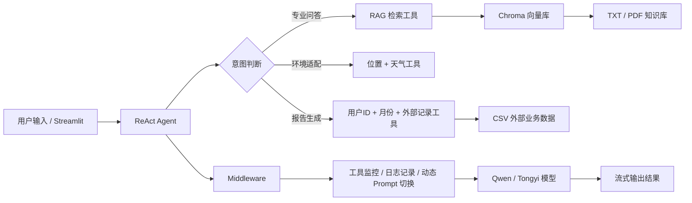

# 面向垂直场景的 Agent + RAG 智能客服项目

这是一个围绕扫地机器人 / 扫拖一体机器人场景打造的智能体项目，基于 `LangChain + LangGraph Runtime + Chroma + Streamlit` 实现，具备领域知识问答、工具协同推理、外部数据读取、动态 Prompt 切换以及个性化报告生成能力。

它不是一个只会“聊天”的大模型 Demo，而是一个从用户提问到知识检索、工具调用、上下文注入、结果生成都打通了的完整 Agent 应用原型。对于求职展示来说，这个项目能够比较直观地体现我对 Agent、RAG、Prompt Engineering 以及工程化落地的理解。


## 项目亮点

- **Agent + RAG 融合落地**：不是单纯检索增强问答，而是将 ReAct 式工具调用与领域知识库结合，让模型具备“先思考、再行动、再总结”的执行链路。
- **垂直领域聚焦明确**：围绕扫地机器人售前咨询、使用指导、故障排查、维护保养、环境适配、报告生成等真实业务场景设计能力边界。
- **多源数据融合**：同时处理非结构化知识库（TXT / PDF）与结构化外部数据（CSV 用户使用记录），更贴近真实业务系统的数据形态。
- **动态 Prompt 切换**：通过中间件注入上下文，在普通客服模式与“报告生成模式”之间动态切换提示词，体现了对 Agent 控制流的设计能力。
- **可观测性较强**：工具调用前后、模型调用前的状态都会被记录到日志中，便于调试、分析和复盘 Agent 行为。
- **知识库支持增量更新**：基于文件 MD5 做去重处理，避免重复向量化，提升知识库维护效率。
- **具备完整展示链路**：项目包含前端交互页、知识库数据、外部记录样本、向量库、提示词配置与日志，开箱即具备作品集展示价值。


项目实现了一条完整的 Agent 执行闭环：

1. 用户在 `Streamlit` 页面中输入问题。
2. `ReactAgent` 基于系统提示词判断当前意图。
3. 若是专业问答，调用 `rag_summarize` 从向量库检索领域知识。
4. 若涉及环境因素，组合调用 `get_user_location` 与 `get_weather` 获取上下文。
5. 若涉及个人使用报告，按固定流程调用 `get_user_id -> get_current_month -> fill_context_for_report -> fetch_external_data`。
6. 中间件根据上下文切换 Prompt，并记录工具与模型执行日志。
7. 最终以流式方式返回更自然、更贴近业务场景的回答或报告。

## 核心能力

### 1. 领域知识问答

- 支持围绕扫地机器人 / 扫拖一体机器人的常见问题进行专业回答
- 覆盖使用建议、故障排除、维护保养、选购指南等内容
- 基于向量检索增强回答准确性，降低纯模型幻觉

### 2. 工具协同推理

- 内置天气、用户位置、用户 ID、当前月份、外部记录读取等工具
- 通过 ReAct 风格流程让模型按需调用工具，而不是把一切写死在 Prompt 里
- 可继续扩展真实业务 API，例如 CRM、IoT、工单系统、设备状态平台等

### 3. 个性化使用报告生成

- 基于用户 ID 与月份读取结构化使用数据
- 自动切换到报告模式，生成更偏“分析 + 建议”的输出
- 体现了大模型与业务数据结合后的个性化服务能力

### 4. 工程化与可维护性

- 配置、Prompt、工具、模型工厂、RAG 服务、日志模块解耦
- 路径统一管理，便于迁移和部署
- 支持 TXT / PDF 知识文件导入与增量向量化

## 技术架构



## 技术栈

- `Python`
- `Streamlit`
- `LangChain`
- `LangGraph Runtime / Middleware`
- `langchain-chroma`
- `Chroma Vector Store`
- `Tongyi / DashScope`
- `PyYAML`
- `PyPDF`

## 项目结构

```text
AI_Agent_Bot/
├─ README.md
└─ AI大模型RAG与智能体开发_Agent项目/
   ├─ app.py                  # Streamlit 入口
   ├─ agent/
   │  ├─ react_agent.py       # Agent 创建与流式执行
   │  └─ tools/
   │     ├─ agent_tools.py    # 工具定义
   │     └─ middleware.py     # 工具监控 / Prompt 切换
   ├─ rag/
   │  ├─ vector_store.py      # 向量库构建与增量加载
   │  └─ rag_service.py       # 检索增强总结服务
   ├─ model/
   │  └─ factory.py           # 模型 / 向量模型工厂
   ├─ prompts/                # 系统提示词与报告提示词
   ├─ config/                 # 配置文件
   ├─ data/                   # 领域知识数据与外部记录样本
   ├─ logs/                   # 运行日志
   └─ utils/                  # 配置、路径、文件、日志等通用工具
```


结构化数据“知识库 + 业务记录”的组合，使项目不只是回答通识问题，还能进一步输出带有用户上下文的个性化结果。


## 项目的展示价值

- **理解 Agent**：能够设计工具、约束调用流程、让模型按业务规则执行任务
- **理解 RAG**：能够完成知识切分、向量存储、检索增强与总结输出
- **理解 Prompt Engineering**：能够通过系统 Prompt 和场景 Prompt 控制模型行为
- **理解工程化落地**：能够把配置、日志、路径、数据、提示词、模型能力拆分成可维护模块
- **理解业务化思维**：不是泛泛而谈 AI，而是让模型围绕清晰垂直场景解决实际问题
